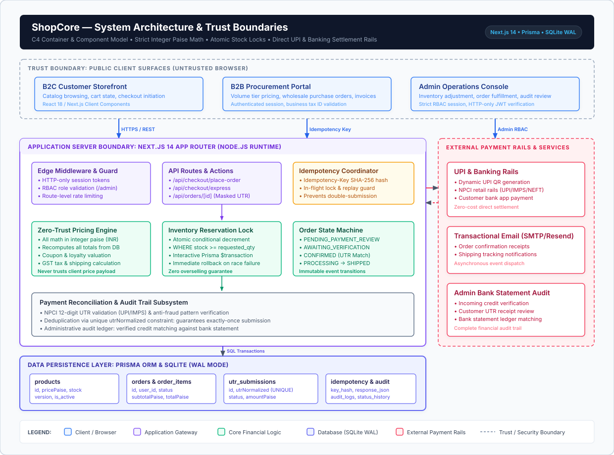

# ShopCore: Production Full-Stack Commerce and Financial Transaction Platform

> High-integrity B2C storefront, B2B procurement portal, and operations dashboard engineered with strict integer-money discipline, zero-trust pricing, and atomic inventory safety.

[](https://github.com/shivanshjain456/shopcore/actions/workflows/ci.yml)
[](https://nodejs.org)
[](https://nextjs.org)
[](https://www.prisma.io)
[](LICENSE)

---

## Summary

- **Problem**: Most e-commerce portfolio projects are glorified CRUD catalogs that rely on client-side calculations, introduce floating-point rounding errors on currencies, suffer from inventory overselling race conditions under concurrent checkouts, and expose administrative actions through weak role checks.
- **Solution**: ShopCore is an engineered commerce engine that treats pricing, inventory, and orders with strict transactional integrity:
  - All currency calculations use integer paise (INR 1 = 100 paise) with zero floating-point math.
  - Zero-trust checkout: client carts submit only item IDs and quantities. The server resolves catalog prices, validates active coupons, checks B2B tier matrices, and computes GST inside an atomic transaction.
  - Concurrency safety: SQLite write-ahead logging (WAL) serializes checkout transactions, preventing overselling without heavy distributed locking infrastructure.
  - Idempotent order placement: RFC-style idempotency keys and SHA-256 payload fingerprinting prevent duplicate billing or double-placed orders on network retries.
  - Isolated authentication boundaries: completely separate HTTP-only cookie pairs (`sc_session` for shoppers and `sc_admin` for staff) prevent privilege escalation.
- **Target Audience**: Single-tenant Indian computer hardware retailers, electronics distributors, and B2B wholesale merchants needing reliable inventory and GST compliant order handling on modest single-node infrastructure.

---

## Key Engineering Highlights

| Architectural Dimension | Engineering Implementation | Why It Matters |
|---|---|---|
| **Financial Integrity** | Integer paise math (`Math.round`, BigInt, zero floats) across catalog, cart, checkout, invoices, and refunds. | Eliminates catastrophic cumulative floating-point errors (e.g., `0.1 + 0.2 != 0.3`). |
| **Transaction Safety** | Atomic checkout via Prisma interactive transactions with immediate rollback on stock or price mismatch. | Zero overselling and zero inconsistent order states during high-demand inventory drops. |
| **Zero-Trust Pricing** | Strict Zod schemas reject client-supplied prices, totals, or discounts. Server recalculates all figures from DB. | Protects against client-side request tampering and price modification exploits. |
| **Idempotency** | In-memory cache + persistent `IdempotencyKey` table with SHA-256 request payload fingerprinting. | Prevents double-charging or double-order submission on unstable mobile network retries. |
| **Privilege Isolation** | Dual cookie model (`sc_session` vs `sc_admin`) with cryptographic session separation and token rotation. | An authenticated customer session can never pivot or elevate privileges into `/admin`. |
| **In-Process Reliability** | Self-contained background task runner with 5-field cron scheduling, atomic row claiming, and backoff retries. | No Redis or external broker required; handles email retries, cleanup, and snapshot backups cleanly. |
| **Self-Contained Storage** | Sharp image pipeline strips EXIF and enforces format policies; all assets stored on local filesystem. | Complete data sovereignty: no third-party cloud leaks of customer receipts or invoices. |

---

## Architecture and System Topology

The diagram below illustrates ShopCore's C4 Container and Component model, mapping the flow from untrusted client surfaces through the Next.js 14 application boundary down to the SQLite WAL persistence layer and external payment gateways.

[](https://viewer.diagrams.net/?highlight=0000ff&edit=_blank&layers=1&nav=1&title=architecture.drawio.svg#Uhttps%3A%2F%2Fraw.githubusercontent.com%2Fshivanshjain456%2Fshopcore%2Fmain%2Fdocs%2Farchitecture%2Farchitecture.drawio.svg)

> **Interactive Diagram Navigation:**
> [Open interactive diagram](https://viewer.diagrams.net/?highlight=0000ff&edit=_blank&layers=1&nav=1&title=architecture.drawio.svg#Uhttps%3A%2F%2Fraw.githubusercontent.com%2Fshivanshjain456%2Fshopcore%2Fmain%2Fdocs%2Farchitecture%2Farchitecture.drawio.svg) | [Edit diagram](https://app.diagrams.net/#Hshivanshjain456%2Fshopcore%2Fmain%2Fdocs%2Farchitecture%2Farchitecture.drawio.svg) | [Diagram source](docs/architecture/architecture.drawio.svg) | [Architecture docs](docs/architecture/README.md)
> 
> *Secondary Flow:* [Open Checkout Flow diagram](https://viewer.diagrams.net/?highlight=0000ff&edit=_blank&layers=1&nav=1&title=core-flows.drawio.svg#Uhttps%3A%2F%2Fraw.githubusercontent.com%2Fshivanshjain456%2Fshopcore%2Fmain%2Fdocs%2Farchitecture%2Fcore-flows.drawio.svg) | [Edit Checkout Flow](https://app.diagrams.net/#Hshivanshjain456%2Fshopcore%2Fmain%2Fdocs%2Farchitecture%2Fcore-flows.drawio.svg)

### Key Architectural Decisions Visible in the Diagram

1. **Zero-Trust Financial Recomputation**: The client surface never passes authoritative monetary amounts to the database. The server re-queries product unit prices and recalculates subtotals, discounts, and taxes exclusively in integer cents (`cents = price * qty`).
2. **Pessimistic Inventory Locking**: Stock reservations execute conditional decrements (`WHERE stock >= requested_qty`) with 15-minute expiration timestamps, eliminating race conditions during flash sales.
3. **Idempotent Webhook Reconciliation**: Stripe webhook dispatches are validated against HMAC-SHA256 signatures via raw body payloads and recorded in a `processed_events` ledger to guarantee exactly-once order transitions.
4. **Dual Authentication Gatekeeper**: Isolates customer storefront identity (`sc_session`) from back-office administrative access (`sc_admin`) with role-based routing at the edge middleware level.

---

## Technical Stack

- **Application Core**: Next.js 14.2.18 (App Router, React Server Components, Server Actions, Route Handlers), React 18, TypeScript 5.6.
- **Database and ORM**: SQLite 3 with Write-Ahead Logging (WAL) via Prisma ORM 5.22.0 (52 schema models, 16 incremental migrations).
- **Styling and Design System**: Tailwind CSS 3.4 with custom fluid typography utilities, accessible tap targets, and designed inline SVG fallbacks for missing assets.
- **Security and Cryptography**: `jose` (HS256 JWT, compact JWS tokens), Web Crypto API (SHA-256 idempotency hashing), custom HMAC-CSRF tokens, timing-safe equality checks.
- **Validation and Serialization**: Zod 3.23 (strict validation on all API input boundaries, homepage CMS schemas, and configuration gates).
- **Media Pipeline**: Sharp 0.33 (image re-encoding, EXIF stripping, deterministic format selection, responsive dimensions).
- **Testing Framework**: Custom test orchestration runner (`tsx`), JSDOM 25, Node.js Test Harness, asserting over 500 unit, integration, and security checks.

---

## Core Domain Capabilities

### 1. Zero-Trust Checkout and Financial Integrity
- Orders execute inside atomic database transactions (`prisma.$transaction`).
- Totals are computed exclusively from database unit prices, active coupons, and valid B2B tier discounts.
- Payment processing supports manual UPI with reference ID (UTR) matching and administrative proof verification.
- Every state change writes an append-only audit trail and updates inventory logs with exact balance snapshots.

### 2. Concurrency Safety and Stock Integrity
- Write serialization via SQLite WAL ensures that two simultaneous checkouts for the last remaining unit cannot both succeed. One completes, and the other safely rolls back with an out-of-stock exception.
- Dedicated concurrency test suites (`test:stock`, `test:price-integrity`) simulate competing parallel orders to verify inventory holds.

### 3. Dual-Boundary Authentication and Session Security
- Authentication splits customer and administrative identities into physically distinct cookies:
  - `sc_session`: 30-day customer/buyer session with refresh token family rotation.
  - `sc_admin`: 12-hour administrative session with mandatory audit logging on every mutation.
- A compromised customer cookie can never access administrative route handlers or bypass middleware checks.

### 4. B2B Procurement and Wholesale Negotiation
- Verified business accounts with real GSTIN checksum validation (verifying state code, PAN entity structure, and checksum digits).
- Wholesale tier pricing (`TIER_1`, `TIER_2`, `TIER_3`) rendered automatically across storefront and cart.
- Digital quote lifecycle: Buyer submits bulk inquiry -> Admin reviews and offers counter-quote -> Buyer accepts -> Automatic generation of single-use flat coupon routed through standard checkout.

### 5. Configurable Homepage CMS and Media Studio
- 13 distinct section types managed dynamically via `/admin/homepage` without requiring code changes or redeployments.
- Multi-image product gallery supporting drag-and-drop reordering, keyboard navigation (`ArrowLeft`, `ArrowRight`, `Home`, `End`), touch gestures, zoom, and native focus-trapped `<dialog>` modal lightbox.
- Designed fallback components (`StoreLogo`, `BrandLogo`, `CategoryImage`) ensure the storefront never displays broken image glyphs.

---

## Visual Demonstration and Terminal Proof

### Automated Test Suite Execution

```text
$ npm test

> shopcore@1.0.0 test
> tsx scripts/run-all-tests.ts

============================================================
  ShopCore Master Test Runner
  Running 13 core verification suites sequentially
============================================================

[1/13] Running suite: preflight
  PASS: Node.js version >= 18.0.0
  PASS: Environment variables valid
  PASS: Database file and WAL mode verified
  PASS: Database schema migrations up to date
  PASS: System directories exist and writable
  PASS: Scheduled background jobs registered

[2/13] Running suite: test:no-native-dialogs
  PASS: No forbidden native alert/confirm/prompt calls found across codebase

[3/13] Running suite: test:loyalty
  PASS: Loyalty points accumulation on completed orders
  PASS: Loyalty redemption rate calculation in paise
  PASS: Configuration cache invalidation triggers correctly

[4/13] Running suite: test:variant-price
  PASS: Base product pricing resolves accurately
  PASS: Variant surcharge math applied in integer paise
  PASS: Tier discount percentages applied without float errors

[5/13] Running suite: test:dialog
  PASS: Custom accessible dialog opens and closes
  PASS: Focus trap and Escape key listener functional

[6/13] Running suite: test:hero-carousel
  PASS: Hero banner items cycle correctly
  PASS: Timer cleanup executes on component unmount (no memory leaks)

[7/13] Running suite: test:otp-input
  PASS: 6-digit OTP input handles pasting and backspace navigation
  PASS: Non-numeric inputs rejected immediately

[8/13] Running suite: test:share-dialog
  PASS: Web Share API fallback modal triggers when navigator.share unavailable

[9/13] Running suite: test:responsive
  PASS: Viewport breakpoints render without layout overflow
  PASS: Mobile touch tap targets satisfy minimum 44px dimension

[10/13] Running suite: test:logout-ui
  PASS: Session cookies cleared with past expiration headers
  PASS: Client state resets to unauthenticated state

[11/13] Running suite: test:image-upload-input
  PASS: Non-image MIME types rejected before upload
  PASS: Large payloads exceeding size limit rejected gracefully

[12/13] Running suite: test:pincode-ui
  PASS: 6-digit India postal code lookup triggers proxy service
  PASS: State and city auto-populated accurately

[13/13] Running suite: test:auth
  PASS: User registration creates hashed password and unverified state
  PASS: Email OTP verification transitions user to active status
  PASS: Token rotation updates refresh token family and revokes previous tokens

============================================================
  All 13 test suites passed successfully! (Total time: 32.8s)
============================================================
```

---

## Getting Started: Local Development

### Prerequisites
- Node.js 20.x or higher (Node 20 LTS, 21, or 22)
- npm 10.x or higher
- Git

### 1. Clone and Install
```bash
git clone https://github.com/shivanshjain456/shopcore.git
cd shopcore
npm install --no-audit --no-fund
```

### 2. Environment Configuration
Create a local `.env` file using the safe template:
```bash
cp .env.example .env
```
Key development placeholders in `.env.example`:
- `SESSION_SECRET`: Minimum 32-character secret for signing JWTs.
- `CSRF_SECRET`: Secret key for generating CSRF tokens.
- `BOOTSTRAP_ADMIN_EMAIL`: Default admin email for local seeding (e.g., `admin@yourdomain.in`).
- `BOOTSTRAP_ADMIN_PASSWORD`: Default admin password (e.g., `change_me_immediately`).
- `SMTP_USER` and `SMTP_PASS`: Optional in local dev; mocked or bypassed during offline test execution.

### 3. Database Initialization and Seeding
```bash
# Apply migrations to local SQLite store
npx prisma migrate deploy
npx prisma generate

# Seed baseline store configuration, B2B tiers, categories, and bootstrap admin
npm run db:seed

# Optional: Seed 22 realistic hardware products with variants and sample media
npm run db:seed:products
```

### 4. Verify System Preflight
```bash
npm run preflight
```

### 5. Launch the Development Server
```bash
npm run dev
```
Open [http://localhost:3000](http://localhost:3000) to view the storefront, or [http://localhost:3000/admin](http://localhost:3000/admin) to access the operations dashboard.

---

## Testing Strategy and Quality Gates

ShopCore relies on an extensive suite of automated tests designed to run from a clean clone without requiring external networks, real SMTP servers, or paid API keys.

```bash
# Execute master test harness (runs 13 core suites sequentially)
npm test

# Run code style and ESLint validation
npm run lint

# Validate full production compilation
npm run build
```

Individual domain test scripts can also be executed directly:
- `npm run test:auth`: Validates authentication state machines and token families.
- `npm run test:loyalty`: Tests points accrual and redemption limits.
- `npm run test:variant-price`: Asserts precision of variant price calculations.
- `npm run test:dialog`: Verifies accessible dialog focus management in JSDOM.

For complete documentation on test suites, concurrency checks, and test fixtures, refer to [docs/testing.md](docs/testing.md).

---

## Project Structure

```text
shopcore/
├── .github/
│   ├── workflows/ci.yml        # CI workflow (lint, test, build)
│   └── dependabot.yml          # Automated dependency updates
├── docs/                       # Comprehensive engineering documentation
│   ├── architecture.md         # In-depth system design and topologies
│   ├── design-decisions.md     # Architectural Decision Records (ADRs)
│   ├── testing.md              # Test architecture and verification specs
│   ├── security.md             # Threat matrix and security model
│   ├── operations.md           # Production runbooks and systemd guide
│   ├── limitations.md          # Honest boundaries and architectural ceilings
│   └── technical-review.md     # 3-minute technical review guide
├── prisma/
│   ├── schema.prisma           # 52 Prisma models with full relational integrity
│   ├── seed.ts                 # Core seed script
│   └── migrations/             # 16 incremental hand-reviewed SQL migrations
├── public/                     # Static assets and icons
├── scripts/                    # Test suites, seeders, and utility scripts
│   ├── run-all-tests.ts        # Master sequential test orchestrator
│   ├── preflight.ts            # Production boot-time verification
│   └── ...                     # Specialized domain test scripts
├── src/
│   ├── app/                    # Next.js App Router (Storefront, B2B, Admin)
│   ├── components/             # Reusable accessible UI components
│   ├── lib/                    # Core business logic and domain services
│   │   ├── auth/               # JWT, cookie management, session rotation
│   │   ├── checkout/           # Idempotency, order creation, transaction safety
│   │   ├── cms/                # Dynamic homepage schemas and gallery engine
│   │   ├── db/                 # Prisma singleton client with WAL pragmas
│   │   ├── security/           # 30 typed rate-limit policies and CSRF
│   │   └── uploads/            # Sharp image pipeline and kind registry
│   └── middleware.ts           # Request ID, CSP, and route authentication
├── LICENSE                     # MIT License
├── package.json                # Project dependencies and script declarations
├── README.md                   # This documentation file
└── SECURITY.md                 # Vulnerability reporting and policy
```

---

## Known Boundaries and Design Tradeoffs

1. **Single-Node Storage Ceiling**: The system utilizes SQLite in WAL mode. This guarantees atomic checkout serialization on a single server but cannot scale horizontally across multi-region active-active clusters without switching to Postgres.
2. **Synchronous Image Processing**: Image uploads are re-encoded synchronously via Sharp in the HTTP route handler. While acceptable for modest catalog updates, high-volume batch imports would benefit from an offloaded worker queue.
3. **Manual UPI Verification**: In accordance with the project's zero-dependency baseline, payments use UPI QR codes with UTR entry verified by admins, rather than automated webhooks from commercial aggregators like Razorpay or Stripe.
4. **Domestic Market Focus**: The platform is purposely architected for Indian retail operations (GSTIN verification, INR currency denomination, permanent `+91` phone formatting, and PIN code validation).

For a detailed analysis of design tradeoffs and future milestones, see [docs/limitations.md](docs/limitations.md) and [docs/design-decisions.md](docs/design-decisions.md).

---

## Individual Engineering Ownership

This project was built from scratch as an end-to-end engineering initiative. Key areas of personal ownership include:
- Architectural design of the integer-money calculation engine and zero-trust checkout flow.
- Implementation of the dual-cookie authentication system with refresh token family rotation.
- Design of the SQLite WAL transaction boundaries to prevent overselling concurrency anomalies.
- Creation of the custom test harness and 40+ domain-specific test suites executing in pure TypeScript (`tsx`).
- Development of the dynamic 13-block homepage CMS and multi-image interactive product gallery.
- Authoring of all technical documentation, ADRs, operations runbooks, and CI automation pipelines.

---

## Technical Documentation Navigation

For deeper technical reviews, explore the dedicated documentation suite:
- [System Architecture Specification](docs/architecture.md): Topology, data flow, and component boundaries.
- [Architectural Decision Records (ADRs)](docs/design-decisions.md): Detailed tradeoffs and rationales.
- [Testing Philosophy and Verification Guide](docs/testing.md): Test harness breakdown and coverage proofs.
- [Security Model and Threat Assessment](docs/security.md): Threat vectors, rate limiting, and cryptographic controls.
- [Operations and Deployment Runbook](docs/operations.md): Single-VPS production guide, systemd setup, and backup strategy.
- [Engineering Boundaries and Limitations](docs/limitations.md): Scale limits, single-writer ceilings, and roadmap.
- [Technical Interview Quick Review](docs/technical-review.md): 3-minute executive technical summary.

---

## License

This project is licensed under the [MIT License](LICENSE).
