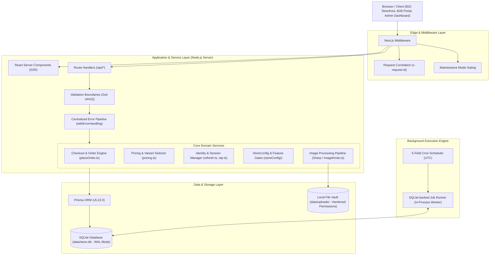
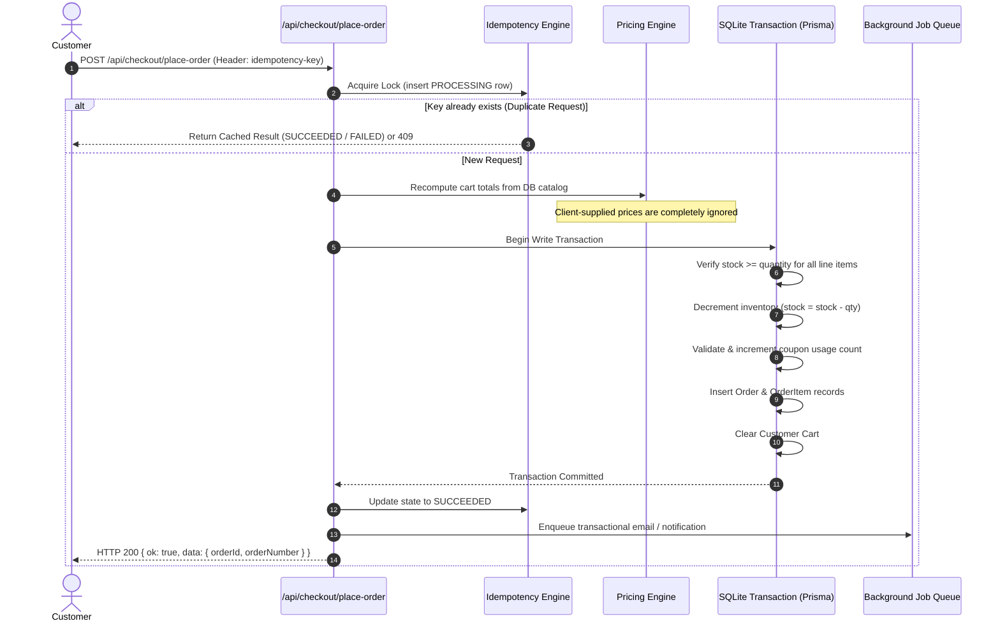

# ShopCore — Architecture & System Design

ShopCore is a full-stack, production-grade e-commerce and financial transaction platform built with Next.js 14 App Router, TypeScript, Prisma, and SQLite. It provides a B2C storefront, a B2B verified-buyer portal, an administrative CMS, and an integrated transaction engine.

---

## 1. System Topology & Component Overview



---

## 2. Architectural Layers & Boundaries

### 2.1 Edge & Middleware Layer (`src/middleware.ts`)
- **Server-Generated Request IDs**: Middleware generates a cryptographically random UUID for every inbound request (`x-request-id`). Inbound client-supplied headers are stripped and overwritten to mitigate log-injection and correlation spoofing.
- **Maintenance Mode Interception**: Reads runtime maintenance mode configuration without incurring heavy database overhead, routing non-admin requests to `/maintenance`.
- **Security Headers**: Injects defensive HTTP response headers, including `Content-Security-Policy`, `X-Content-Type-Options: nosniff`, `X-Frame-Options: DENY`, `Referrer-Policy: strict-origin-when-cross-origin`, and `Permissions-Policy`.

### 2.2 Client Layer: Server Components vs Client Islands
- **Server Components by Default**: Catalog browsing, product display pages (PDP), category indexes, and admin layouts are rendered on the server, minimizing client-shipped JavaScript and improving Time to First Byte (TTFB).
- **Client Islands (`'use client'`)**: Isolated to stateful, highly interactive user experiences:
  - `<InteractiveProductGallery>`: Swipe gestures, thumbnail swapping, keyboard navigation, and fullscreen modal viewer.
  - `<CartDrawer>` and `<AddToCartButton>`: Real-time optimistic client state synced with server cart mutations.
  - `<PincodeField>`: Debounced PIN lookup against India Post directory with auto-fill.
  - `<AppDialog>`: Native HTML5 `<dialog>` modal controller managing promises, focus traps, and keyboard listeners.

### 2.3 API & Route Layer
- **Envelope Standardization**: Every API response follows a strict, predictable JSON contract:
  ```json
  // Success (2xx)
  { "ok": true, "data": { ... } }
  
  // Error (4xx / 5xx)
  { "ok": false, "error": "Human readable message", "code": "SCREAMING_SNAKE_CASE", "issues": [] }
  ```
- **Centralized Error Handling (`withErrorHandling`)**: Wraps route handlers. Catches domain errors (`ShopCoreError` hierarchy), Prisma constraints, and unexpected runtime exceptions. It guarantees that raw database column names and stack traces never leak over the network.
- **Strict Zod Boundaries**: Request bodies on mutating endpoints are validated through Zod schemas configured with `.strict()`. Unexpected fields (such as client-injected prices or totals) are rejected immediately.

### 2.4 Data Access Layer
- **Prisma Client (v5.22.0)**: Interfaces with SQLite (`data/store.db`).
- **SQLite Concurrency & Transaction Model**: SQLite operates in WAL (Write-Ahead Logging) mode. Concurrent reads proceed without locking. Concurrent write operations are serialized through database-level transactions, providing race-free guarantees for order placement and stock reservation.

---

## 3. Core Domain Subsystems

### 3.1 Order Placement & Checkout Subsystem



Key guarantees:
1. **Integer Money Everywhere**: Monetary values (`totalPaise`, `subtotalPaise`, `taxPaise`, `discountPaise`) are stored as 64-bit integers.
2. **Zero-Trust Pricing**: Cart items submitted by the user only provide `productId`, `variantId`, and `quantity`. Unit prices are fetched freshly from the database inside the checkout transaction.
3. **Inventory Race Protection**: Inventory decrements occur inside the same serializable write transaction as order creation. If stock is insufficient, the transaction rolls back, returning `409 INSUFFICIENT_STOCK`.

### 3.2 Authentication & Session Architecture

ShopCore implements an isolated, dual-cookie session model:

| Cookie Name | Target Audience | Lifespan | Flags | Scope |
| ----------- | --------------- | -------- | ----- | ----- |
| `sc_session`| Customer / B2B  | 30 Days  | `HttpOnly`, `SameSite=Strict`, `Secure` | Storefront & `/account` |
| `sc_admin`  | Staff / Admin   | 12 Hours | `HttpOnly`, `SameSite=Strict`, `Secure` | `/admin` routes only |
| `sc_csrf`   | All Sessions    | Session  | `SameSite=Strict`                       | CSRF Double-Submit token |

- **Refresh Token Families**: Refresh tokens are grouped into cryptographic families in the database. When a token is refreshed, the old token is marked revoked and a new one is issued. If an already-revoked token is presented, the system detects a token replay attack and immediately revokes all tokens within that family.
- **Firebase Identity Mirror**: Optional Firebase Admin authentication linkage allows mirroring identities while preserving SQLite as the operational authority.

### 3.3 Background Jobs & Scheduled Tasks

Instead of requiring external message queues (e.g. Redis, RabbitMQ) that introduce operational complexity for small-to-medium deployments, ShopCore features an in-process, SQLite-backed job engine (`src/lib/jobs/`):

- **Job Worker Pipeline**:
  - `JobRunner`: Polls the `Job` table with atomic claims (`UPDATE Job SET status='PROCESSING' WHERE status='PENDING' LIMIT N`).
  - Implements exponential backoff on retries and automatic stuck-job recovery (detects jobs locked past `JOB_RUNNER_LOCK_TTL_MS`).
  - Supports graceful shutdown on `SIGTERM` / `SIGINT`, waiting for in-flight tasks to drain cleanly.
- **Job Scheduler**:
  - In-memory 5-field cron parser (`minute hour dom month dow`) in UTC.
  - Automatically seeds recurring maintenance schedules:
    - `cleanup_expired_otps`: Prunes stale verification codes.
    - `cleanup_expired_sessions`: Evicts revoked session records.
    - `abandoned_cart_reminder`: Identifies inactive carts and queues reminders.
    - `db_vacuum`: Runs SQLite maintenance and defragmentation.
    - `db_backup`: Generates consistent `VACUUM INTO` snapshots to `data/backups/`.

---

## 4. Data Model Highlights

The relational schema (`prisma/schema.prisma`) comprises 52 models. Core relationships:

- **`User`**: Identity anchor with polymorphic role (`CUSTOMER`, `B2B`, `ADMIN`), phone verification state, address linkages, and referral hierarchy.
- **`Product` & `ProductVariant`**: Master catalog entity with SKU, inventory counts, pricing in paise, dynamic attributes (JSON), and relationship to categories and brands.
- **`ProductImage`**: Ordered gallery images with primary image designation and compound index `(productId, isActive, sortOrder)`.
- **`Order` & `OrderItem`**: Financial ledger capturing unit prices at purchase time, tax snapshots, order status history, and payment UTR linkages.
- **`StoreConfig`**: Singleton key-value store powering 123+ dynamic operational parameters with runtime schema validation.
- **`AuditLog`**: Tamper-evident admin action record logging actor, resource, action, and JSON payload diffs.
